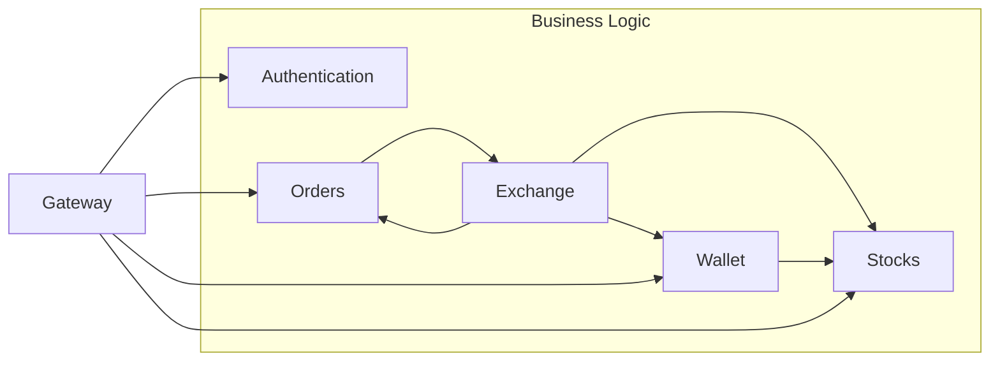

# Rapport Vinci Stock Exchange

<!-- TOC -->

* [Rapport Vinci Stock Exchange](#rapport-vinci-stock-exchange)
    * [Services Description](#services-description)
      * [Gateway : 8080](#gateway--8080)
      * [Authentication : 9000](#authentication--9000)
      * [Wallet : 9001](#wallet--9001)
      * [Orders : 9002](#orders--9002)
      * [Stocks : 9005](#stocks--9005)
      * [Exchange : 9006](#exchange--9006)
    * [Services Diagram](#services-diagram)

<!-- TOC -->

## Services description

### Gateway : 8080

_Description_ : Gateway to all services 
_Responsabilities_ : Allow the frontend to use all the services and manage the authentication

### Authentication : 9000

_Description_ : Authentication service contains all the user's authentication logic 
_Responsabilities_ : Manage the user's authentication

### Wallet : 9001
_Description_ : Contains all the user's assets and the user's wallet logic> 
_Responsabilities_ :  Manage the user's assets 

### Orders : 9002
_Description_ :  Contains all the orders 
_Responsabilities_ : Manage the access and modification to the orders

### Stocks : 9005
_Description_ : Contains all the stocks 
_Responsabilities_ : Manage the access and modification of the stocks

### Exchange : 9006
_Description_ : Contains all the exchange logic 
_Responsabilities_ : Execute the orders and manage the changes in the stocks, the wallet and the orders

## Services Diagram

