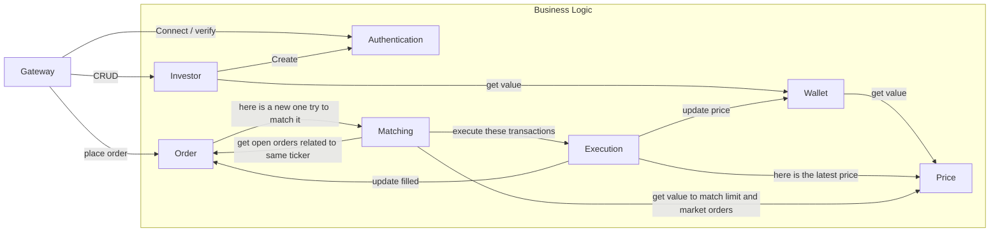

# Decoupe en services du projet VSX

La découpe en service de ce projet comprend 4 "gros services" (non, ce sont des micro services mais ils
sont un peu plus importants que les autres) et 4 "petits services" (ils sont encore plus micro que les
autres). Ce qui tombe bien puisque vous êtes 4 étudiants par groupe. Lors de la 2e phase du projet, il
faudra donc que chaque étudiant soit responsable de l'implémentation d'un service parmi chacun de ces
ensembles.

### Petits services
- Investor
- Authentication
- Order
- Price

### 'Gros' services
- Wallet
- Matching
- Execution
- Gateway

--- La découpe en services commence ici ---------------------------------------------------------------

## Investor
Le role de ce service est de maintenir les données signalétiques (userid, nom, prenom, etc...) 
d'un investisseur.

**Note:** 
Lorsqu'on crée un un investisseur ou qu'on le supprime, il est nécessaire d'aussi creer ses
credentials (service authentication)

## Authentication
Le role de ce service est de permettre l'authentification des investisseurs sur la plateforme VSX.

## Wallet
Le role de ce service est de tenir à jour la liste des possessions d'un investisseur.
C'est dans ce portefeuille qu'on peut retrouver la liste des positions (= un titre avec la quantité possédée).
En particulier, il est intéressant de noter qu'on traite le cash de la meme façon que n'importe
quel autre possession. Le symbole utilisé pour le cash sera donc "CASH".

Ce service fait l'hypothèse qu'il existe une position 0 pour tous les titres qui ne sont pas ou plus 
possédés par un investisseur. Ceci signifie qu'il n'est pas possible de distinguer les deux scénario suivants:
* Michel achete trois actions "LNRD", puis les revends 5 ans plus tard.
* Michel n'a jamais acheté la moindre action "LNRD" parce qu'il pense que ce n'est pas une société fiable.

## Order
Le role de ce service est de maintenir la liste des ordres qui ont été passés et leur statut.

**Note:** 
Ce n'est pas le service d'ordre qui va se charger de faire le matching entre plusieurs ordres. Ce n'est
pas non plus le service d'ordre qui va se charger d'effectivement _exécuter_ les ordres. Par contre, 
il est important de noter que la création d'un ordre va notifier le service de matching qui chercher
à satisfaire l'ordre nouvellement créé avec un autre ordre présent dans le système.

## Matching
Le role de ce service est d'identifier des groupes d'ordres qui peuvent être (partiellement) satisfaits
les uns par les autres. Lorsqu'un matching est effectué, ce service contacte le service d'exécution
et lui transmets les transactions qui doivent être effectuées.

**Note:**
Dans un monde idéal, ce service devrait être notifié de façon asynchrone via une file d'attente et devrait
traiter toutes ses requêtes de façon séquentielles. Sans ça, il est possible que le système crée des
inconsistances en utilisant plusieurs fois un même ordre pour en satisfaire plusieurs autres (a cause du
fait que plusieurs requetes peuvent être traitées de façon simultanée et que nous n'avons pas prévu de
système de verrouillage distribué). 
**DANS LE CADRE DE CE PROJET, ON VA CONSIDERER QUE CE N'EST PAS UN PROBLEME.** 
C'est un choix délibéré qui vise à vous faciliter la vie tout et à garder un scope raisonnable pour ce projet.

## Execution.
Le service d'exécution recoit des transactions  à effectuer, et se charge de contacter les autres
services (Wallet, Order, Prices) pour refléter l'exécution de la transaction. Par exemple, lorsque
le service reçoit une requête pour exécuter le la transaction: 
"Etant donné les ordres #CAFECAFE et #DEADBEEF vendre 10 actions LNRD de Alice à Bob pour 5 CASH chacune" 
1. Le service _Execution_ va contacter le service _Wallet_ pour mettre à jour la quantité de CASH possédée par Alice
2. Le service _Execution_ va contacter le service _Wallet_ pour mettre à jour la quantité de CASH possédée par Bob
3. Le service _Execution_ va contacter le service _Wallet_ pour mettre à jour la quantité de LNRD possédée par Alice
4. Le service _Execution_ va contacter le service _Wallet_ pour mettre à jour la quantité de LNRD possédée par Bob
5. Le service _Execution_ va contacter le service _Price_  pour indiquer que le dernier prix de vente pour une action LNRD était de 5 CASH.
6. Le service _Execution_ va contacter le service _Order_ pour mettre à jour le statut de l'ordre #CAFECAFE
7. Le service _Execution_ va contacter le service _Order_ pour mettre à jour le statut de l'ordre #DEADBEEF

## Price
La seule responsabilité du service _Price_ est de se rappeler le dernier prix d'échange (= prix market) pour
tous les titres en circulation sur la plateforme VSX. 

**Note:**
Votre plateforme ne doit pas gérer les IPO (initial public offer = introductions en bourse). De ce fait, 
et comme cela a été explicité dans les spécifications du projet, dans le cas (théorique) ou les ordres 
de Alice et Bob seraient les tout premiers ordres relatifs à des actions LNRD sur votre plateforme, 
alors on décidera par convention que le prix est de 1 euro par action (ça ne se passe pas comme ça dans 
la réalité, mais c'est la logique que vous devez implémenter).

En utilisant cette logique, et puisque tous les échanges sont libellés en CASH (il n'est donc pas possible
de vendre 1 CASH pour autre chose que 1 CASH), le 'prix' du CASH restera toujours fixé à 1 (pratique non ?).

## Gateway
Le gateway est le point d'entrée vers VSX depuis le monde extérieur. Ce point d'entrée doit s'assurer
que tous les services qui sont appelés, le soient dans des conditions correctes. C'est à dire que
c'est le gateway qui va s'assurer que l'investisseur soit authentifié avant de pouvoir appeler d'autres 
services.

Ce point d'entrée veillera à n'exposer que les fonctionalités relevantes au monde extérieur. En particulier, 
le gateway permettra:  

* la création d'un investisseur
* a un investisseur de s'authentifier
* a un investisseur de supprimer son compte
* a un investisseur de consultater de ses données signalétiques
* a un investisseur de modifier son mot de passe 
* a un investisseur de passer un ordre
* a un investisseur de lister tous les ordres qu'il a passé
* a un investisseur de consulter la composition de son portefeuille
* a un investisseur de calculer la valeur totale de son portefeuille.
* a un investisseur de verser du CASH sur son compte
* a un investisseur de retirer du CASH sur son compte
* a un investisseur de connaitre le dernier prix d'échange de n'importe quel titre en échange sur la plateforme.

## Call (pour les groupes de 5)
Ce service contacte tous les jours le service Wallet. Pour chaque investisseur possédant une quantité négative d'un instrument financier, 
ce service prélève une quantité de CASH équivalent à 1% la valeur du titre multipliée par la quantité manquante.

Par exemple, l'investisseur picsou possède les instruments financiers suivant :
- 10 actions LNRD, ce titre ayant une valeur actuelle de 87 CASH par action
- -5 actions AAPL, ce titre ayant une valeur actuelle de 100 CASH par action
- -100 CASH

Pour ses actions LNRD, cet investisseur a une quantité positive, il n'est donc pas ponctionné.
Pour ses actions AAPL, une somme de (5x100/10)=5 CASH est prélevée comme intérêt sur ses actions manquantes.
Pour son CASH, une somme de (1x100/10)=1 CASH est prélevée comme intérêt sur son CASH manquant.

Suite à l'intervention du service de call, picsou possèdera les instruments financiers suivant :
- 10 actions LNRD
- -5 actions AAPL
- -106 CASH, 6 CASH ayant été prélevées comme intérêts

## Diagramme de services
